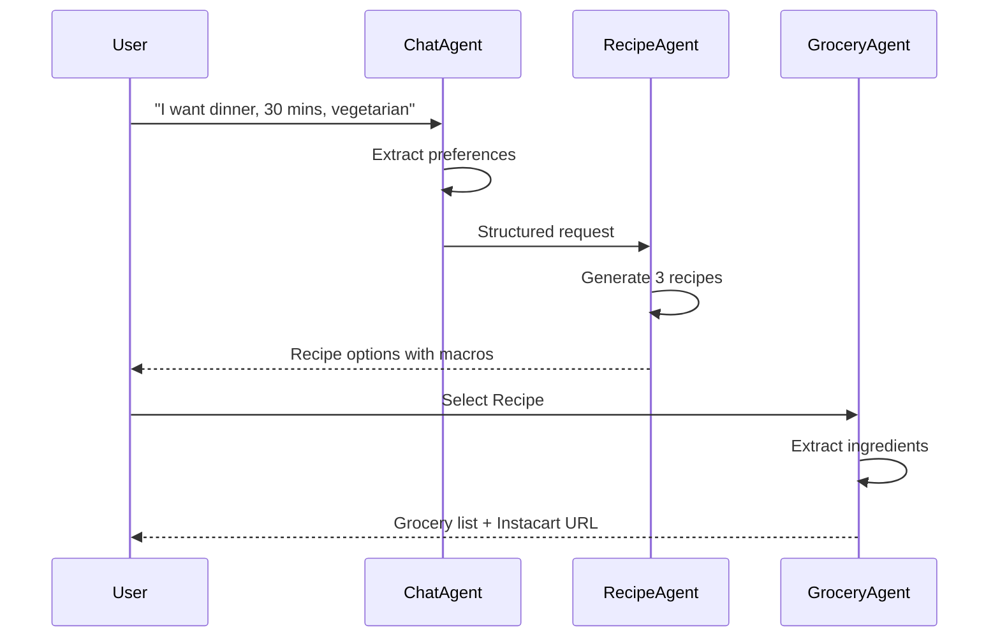

# 🥗 Agentic Grocery

> **Multi-Agent Food Recommendation & Grocery Automation Platform**  
> Built with [Fetch.ai uAgents](https://fetch.ai) | ASI:One Compatible | Agentverse Ready

[](https://www.python.org/)
[](https://fastapi.tiangolo.com/)
[](https://fetch.ai)
[](LICENSE)

## 🌟 Overview

**Agentic Grocery** is an intelligent multi-agent system that combines personalized meal planning with automated grocery ordering. Built for the Fetch.ai hackathon, it demonstrates the power of autonomous agents working together to solve real-world problems.

### Key Features

- 🤖 **Three Specialized Agents**: ChatAgent, RecipeAgent, and GroceryAgent
- 📡 **Chat Protocol v0.3.0**: Fully compliant with Fetch.ai standards
- 🍽️ **AI-Powered Recipes**: Claude API generates 4-5 personalized recipes
- 🛒 **Real Grocery Pricing**: Kroger API integration for live product data
- 📊 **Structured Ingredients**: Quantity, unit, and preparation notes
- 📝 **Markdown Instructions**: Beautifully formatted cooking steps
- 🖼️ **AI Food Images**: Auto-generated recipe visuals
- 🔐 **User Authentication**: JWT-based auth with SQLite database
- 📱 **Mobile-Ready API**: Complete endpoints for app integration
- 🎯 **Agentverse Ready**: Pre-configured for agent registration

## 🏗️ Architecture

```
┌─────────────┐
│   User/API  │
└──────┬──────┘
       │
       ▼
┌─────────────┐     ┌──────────────┐     ┌───────────────┐
│ ChatAgent   │────▶│ RecipeAgent  │────▶│ GroceryAgent  │
└─────────────┘     └──────────────┘     └───────────────┘
       │                    │                      │
       ▼                    ▼                      ▼
  Extract Intent      Generate Recipes      Create List
  Get Preferences     Calculate Macros      Estimate Costs
  Coordinate Flow     3 Options/Meal        Instacart Format
```

### Agent Responsibilities

#### 🗣️ ChatAgent
- Handles user conversations via FastAPI `/chat` endpoint
- Extracts dietary preferences, goals, and constraints
- Prompts for missing information (meal type, cook time)
- Forwards structured requests to RecipeAgent

#### 🍳 RecipeAgent
- Generates 4-5 personalized meal options using Claude API
- **Structured ingredients**: Name, quantity (numeric), unit, preparation notes
- **Markdown instructions**: Formatted with emojis and step-by-step guidance
- **AI-generated images**: Food photos using Pollinations.ai
- Calculates macros based on user goals (cut, bulk, maintain)
- Compatible with Chat Protocol v0.3.0

#### 🛒 GroceryAgent
- **Kroger API integration**: Real product search and pricing
- Extracts structured ingredients from recipes
- Returns product IDs, UPCs, and brand information
- Shows Kroger vs estimated pricing transparency
- Generates Kroger cart URLs for direct ordering

## 🚀 Quick Start

### Prerequisites

- Python 3.9 or higher
- pip (Python package manager)

### Installation

1. **Clone the repository**
```bash
git clone https://github.com/yourusername/agentic-grocery.git
cd agentic-grocery
```

2. **Install dependencies**
```bash
pip install -r requirements.txt
```

3. **Set up environment variables**
```bash
cp env.example .env
# Edit .env with your API keys:
# - ANTHROPIC_API_KEY (for Claude API)
# - KROGER_CLIENT_ID (for Kroger API)
# - KROGER_CLIENT_SECRET (for Kroger API)
# - JWT_SECRET_KEY (for authentication)
# - Agent seeds and database URL
```

4. **Run the FastAPI server**
```bash
python main.py
# or
uvicorn main:app --reload --port 8000
```

5. **Access the API**
- API Root: http://localhost:8000
- Interactive Docs: http://localhost:8000/docs
- Alternative Docs: http://localhost:8000/redoc

## 📡 API Endpoints

### 🔐 Authentication

**Register User**
```bash
POST /auth/register
{
  "username": "john_doe",
  "email": "john@example.com",
  "password": "securepassword123"
}
```

**Login**
```bash
POST /auth/login
{
  "username": "john_doe",
  "password": "securepassword123"
}
# Returns: {"access_token": "eyJ...", "token_type": "bearer"}
```

### 👤 User Profile

**Get Profile** (requires auth)
```bash
GET /profile
Headers: Authorization: Bearer <token>
```

**Update Profile** (requires auth)
```bash
PUT /profile
Headers: Authorization: Bearer <token>
{
  "height_cm": 175,
  "weight_kg": 70,
  "goal": "cut",
  "diet": "vegetarian"
}
```

### 🤖 Agent Endpoints

**Chat with ChatAgent** (requires auth)
```bash
POST /chat
Headers: Authorization: Bearer <token>
{
  "message": "I want a high protein vegetarian dinner, 30 min cook time"
}
```

**Generate Recipes** (requires auth)
```bash
POST /recipe
Headers: Authorization: Bearer <token>
{
  "preferences": {
    "meal_type": "dinner",
    "cook_time": "30 mins",
    "cuisine": "indian"
  }
}
# Returns 4-5 recipes with structured ingredients, markdown instructions, AI images
```

**Create Grocery List** (requires auth)
```bash
POST /grocery
Headers: Authorization: Bearer <token>
{
  "recipe": {
    "title": "Paneer Tikka Bowl",
    "ingredients": [
      {"name": "paneer", "quantity": 200, "unit": "g", "notes": "cubed"}
    ]
  },
  "store_preference": "Kroger"
}
# Returns list with real Kroger prices, product IDs, UPCs
```

### 📝 Recipe Management

**Get Saved Recipes** (requires auth)
```bash
GET /recipes
```

**Save Recipe** (requires auth)
```bash
POST /recipes/save
{
  "recipe_data": {...}
}
```

**Favorite Recipe** (requires auth)
```bash
POST /recipes/{recipe_id}/favorite
```

### 🛒 Grocery Lists

**Get All Lists** (requires auth)
```bash
GET /grocery-lists
```

**Complete List** (requires auth)
```bash
POST /grocery-lists/{list_id}/complete
```

### 📊 Meal & Stats

**Log Meal** (requires auth)
```bash
POST /meals/log
{
  "recipe_id": 1,
  "meal_type": "dinner"
}
```

**Get Meal History** (requires auth)
```bash
GET /meals/history
```

**Get User Stats** (requires auth)
```bash
GET /stats
# Returns: recipes saved, grocery lists, meals logged, favorites
```

### 🔍 System Info

**Health Check**
```bash
GET /health
```

**Agents Metadata**
```bash
GET /agents-metadata
# Returns Chat Protocol v0.3.0 info for all agents
```

📚 **Interactive API Docs**: http://localhost:8000/docs

## 🤝 Example Flow



## 🎯 Fetch.ai Integration

### uAgents Setup

Each agent is built with `uagents` framework:

```python
from uagents import Agent, Context

chat_agent = Agent(
    name="ChatAgent",
    seed="chat-agent-seed-12345",
    port=8001,
    endpoint=["http://localhost:8001/submit"]
)

@chat_agent.on_message(model=ChatRequest)
async def handle_message(ctx: Context, sender: str, msg: ChatRequest):
    # Process message
    await ctx.send(sender, response)
```

### Chat Protocol v0.3.0 Implementation

All agents are fully compliant with Fetch.ai's Chat Protocol v0.3.0:

- ✅ `Protocol("chat", version="0.3.0")` registered
- ✅ `@protocol.on_message` handlers for agent-to-agent communication
- ✅ `agent.include(protocol)` for Agentverse discovery
- ✅ Structured JSON responses with Pydantic models
- ✅ Protocol logging with `[Chat Protocol v0.3.0]` prefix
- ✅ Dual handlers: FastAPI + Protocol for maximum compatibility
- ✅ Compatible with [ASI:One documentation](https://docs.asi1.ai)

**Verify Protocol Compliance:**
```bash
python test_protocol.py
```

All agents will show ✅ COMPLIANT status.

### Agentverse Registration

1. **Get Agent Addresses**
```bash
# Run each agent to get its address
python agents/chat_agent/agent.py
python agents/recipe_agent/agent.py
python agents/grocery_agent/agent.py

# Each will output: "Agent address: agent1qw..."
```

2. **Register on Agentverse**
   - Visit [agentverse.ai](https://agentverse.ai)
   - Create new agent for each
   - Enter agent address
   - Specify protocol: `chat v0.3.0`
   - Add metadata (Name, Description, Tags from agent docstrings)

3. **Agent Metadata** (embedded in code)
   - **ChatAgent**: Conversational entrypoint, tags: nutrition, recipes, chatbot
   - **RecipeAgent**: AI recipe generator, tags: meal-planning, claude, fetchai
   - **GroceryAgent**: Kroger API integration, tags: grocery, shopping, automation

4. **API Endpoints** (for FastAPI integration)
   - ChatAgent: `POST http://localhost:8000/chat`
   - RecipeAgent: `POST http://localhost:8000/recipe`
   - GroceryAgent: `POST http://localhost:8000/grocery`

📚 **See `AGENTVERSE_GUIDE.md` for detailed registration steps**

## 📊 User Profile

Users can be personalized with dietary profiles stored in `data/user_profile.json`:

```json
{
  "user": "raj",
  "height_cm": 175,
  "weight_kg": 70,
  "goal": "cut",
  "diet": "vegetarian",
  "workout_frequency": "5/week",
  "likes": ["spicy", "south indian"],
  "dislikes": ["mushrooms"],
  "target_macros": {
    "protein_g": 140,
    "carbs_g": 200,
    "fat_g": 50,
    "calories": 1800
  }
}
```

## 🛠️ Technology Stack

- **Backend**: FastAPI, Uvicorn
- **Agents**: Fetch.ai uAgents (Chat Protocol v0.3.0)
- **AI/LLM**: Anthropic Claude API for recipe generation
- **Grocery API**: Kroger API for real product pricing
- **Image Generation**: Pollinations.ai (free AI image service)
- **Database**: SQLite with SQLAlchemy ORM
- **Authentication**: JWT tokens with bcrypt password hashing
- **Validation**: Pydantic v2.8+
- **HTTP Client**: httpx, requests
- **Logging**: Custom logger with rich console
- **Environment**: python-dotenv

## 📝 Development

### Project Structure

```
agentic-grocery/
├── agents/
│   ├── chat_agent/
│   │   └── agent.py          # Chat Protocol v0.3.0 conversational agent
│   ├── recipe_agent/
│   │   └── agent.py          # Claude API recipe generator (4-5 recipes)
│   └── grocery_agent/
│       └── agent.py          # Kroger API grocery list builder
├── data/
│   └── user_profile.json     # User dietary profiles (mock data)
├── utils/
│   └── logger.py             # Rich logging utility
├── main.py                   # FastAPI app (auth, agents, mobile endpoints)
├── database.py               # SQLite models (User, Profile, Recipes, Lists)
├── auth.py                   # JWT authentication & password hashing
├── requirements.txt          # Python dependencies (uagents 0.20.1, pydantic 2.8+)
├── env.example               # Environment template (Claude, Kroger, JWT keys)
├── test_api.py               # API endpoint tests
├── test_protocol.py          # Chat Protocol compliance validator
├── AGENTVERSE_GUIDE.md       # Step-by-step Agentverse registration
├── CHAT_PROTOCOL_IMPLEMENTATION.md  # Protocol implementation details
├── FLOW_SUMMARY.md           # System architecture and data flow
└── README.md                 # This file
```

### Running Individual Agents

You can run each agent independently:

```bash
# ChatAgent
python agents/chat_agent/agent.py

# RecipeAgent
python agents/recipe_agent/agent.py

# GroceryAgent
python agents/grocery_agent/agent.py
```

### API Keys and Configuration

#### Claude API (Recipe Generation)
```bash
# Get API key from: https://console.anthropic.com
ANTHROPIC_API_KEY=your_key_here
```

#### Kroger API (Grocery Pricing)
```bash
# Register at: https://developer.kroger.com
KROGER_CLIENT_ID=your_client_id
KROGER_CLIENT_SECRET=your_client_secret
```

The system will automatically use these APIs when configured. Without API keys, it falls back to mock data for testing.

## 🏆 Hackathon Highlights

### Fetch.ai Award Requirements

- ✅ **Multi-Agent System**: 3 specialized agents
- ✅ **uAgents Framework**: All agents use `uagents`
- ✅ **ASI:One Compatible**: Chat Protocol v0.3.0
- ✅ **Agentverse Ready**: Pre-configured metadata
- ✅ **Discoverable**: Tags and descriptions
- ✅ **Working Endpoints**: Full API implementation
- ✅ **Structured Data**: JSON-only responses

### Demo Features

1. **Conversational AI**: Natural language meal requests
2. **Personalization**: User profiles with dietary goals
3. **Macro Tracking**: Automatic calculation and distribution
4. **Real-World Integration**: Mock Instacart ordering
5. **Scalable**: Ready for production APIs

## ✅ Recent Enhancements

- ✅ **Chat Protocol v0.3.0**: Full compliance for ASI:One
- ✅ **Claude API**: AI-powered recipe generation
- ✅ **Kroger API**: Real product pricing and details
- ✅ **Structured Ingredients**: Quantity, unit, preparation notes
- ✅ **Markdown Instructions**: Beautiful formatting with emojis
- ✅ **AI-Generated Images**: Recipe visuals from Pollinations.ai
- ✅ **User Authentication**: JWT with bcrypt
- ✅ **SQLite Database**: User profiles, recipes, grocery lists
- ✅ **Mobile API**: Complete endpoints for app integration
- ✅ **Meal Logging**: Track nutrition and history

## 🔮 Future Enhancements

- [ ] Additional grocery APIs (Instacart, Walmart, Amazon Fresh)
- [ ] Nutrition tracking dashboard with charts
- [ ] Recipe rating and feedback system
- [ ] Multi-language support
- [ ] Voice interface support
- [ ] Social features (share recipes, meal plans)
- [ ] Meal prep scheduling and reminders
- [ ] Ingredient substitution suggestions

## 📚 Resources

- [Fetch.ai Documentation](https://docs.fetch.ai)
- [uAgents Guide](https://fetch.ai/docs/guides/agents/getting-started/whats-an-agent)
- [ASI:One Docs](https://docs.asi1.ai)
- [Agentverse](https://agentverse.ai)
- [FastAPI Docs](https://fastapi.tiangolo.com)

## 🤝 Contributing

Contributions are welcome! Please feel free to submit a Pull Request.

## 📄 License

This project is licensed under the MIT License - see the LICENSE file for details.

## 👥 Team

Built with ❤️ for the Fetch.ai Hackathon

## 🙏 Acknowledgments

- Fetch.ai for the amazing uAgents framework
- FastAPI for the excellent web framework
- OpenAI for LLM capabilities
- The open-source community

---

**Ready to revolutionize meal planning and grocery shopping with autonomous agents!** 🚀
