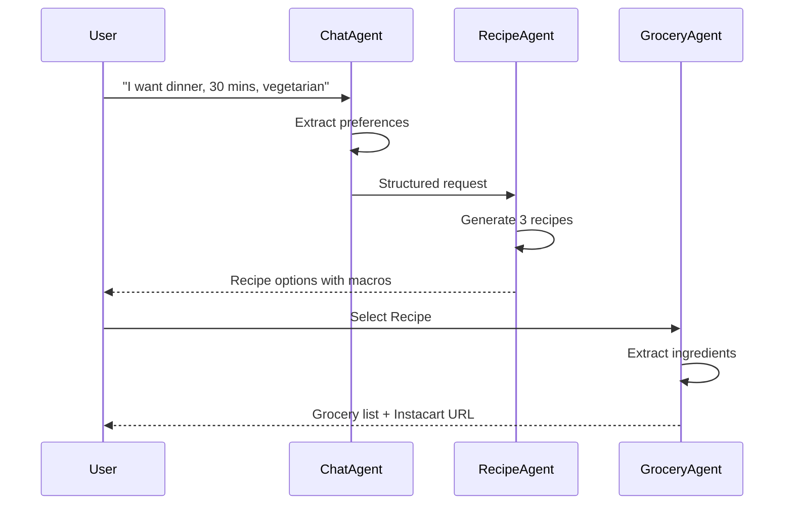

# 🥗 Agentic Grocery

> **Multi-Agent Food Recommendation & Grocery Automation Platform**  
> Built with [Fetch.ai uAgents](https://fetch.ai) | ASI:One Compatible | Agentverse Ready

[](https://www.python.org/)
[](https://fastapi.tiangolo.com/)
[](https://fetch.ai)
[](LICENSE)

## 🌟 Overview

**Agentic Grocery** is an intelligent multi-agent system that combines personalized meal planning with automated grocery ordering. Built for the Fetch.ai hackathon, it demonstrates the power of autonomous agents working together to solve real-world problems.

### Key Features

- 🤖 **Three Specialized Agents**: ChatAgent, RecipeAgent, and GroceryAgent
- 🍽️ **Personalized Meal Planning**: Based on dietary goals, preferences, and macros
- 🛒 **Automated Grocery Lists**: Ready for Instacart ordering
- 🔄 **ASI:One Compatible**: Follows Chat Protocol v0.3.0
- 📊 **Structured Data**: All responses in JSON format
- 🎯 **Agentverse Ready**: Pre-configured for agent registration

## 🏗️ Architecture

```
┌─────────────┐
│   User/API  │
└──────┬──────┘
       │
       ▼
┌─────────────┐     ┌──────────────┐     ┌───────────────┐
│ ChatAgent   │────▶│ RecipeAgent  │────▶│ GroceryAgent  │
└─────────────┘     └──────────────┘     └───────────────┘
       │                    │                      │
       ▼                    ▼                      ▼
  Extract Intent      Generate Recipes      Create List
  Get Preferences     Calculate Macros      Estimate Costs
  Coordinate Flow     3 Options/Meal        Instacart Format
```

### Agent Responsibilities

#### 🗣️ ChatAgent
- Handles user conversations via FastAPI `/chat` endpoint
- Extracts dietary preferences, goals, and constraints
- Prompts for missing information (meal type, cook time)
- Forwards structured requests to RecipeAgent

#### 🍳 RecipeAgent
- Generates 2-3 personalized meal options
- Calculates macros based on user goals (cut, bulk, maintain)
- Includes ingredients, instructions, and cook time
- Compatible with OpenAI/ASI:One LLM integration

#### 🛒 GroceryAgent
- Extracts ingredients from selected recipes
- Creates formatted grocery lists
- Estimates costs and categorizes items
- Generates mock Instacart order URLs

## 🚀 Quick Start

### Prerequisites

- Python 3.9 or higher
- pip (Python package manager)

### Installation

1. **Clone the repository**
```bash
git clone https://github.com/yourusername/agentic-grocery.git
cd agentic-grocery
```

2. **Install dependencies**
```bash
pip install -r requirements.txt
```

3. **Set up environment variables**
```bash
cp .env.example .env
# Edit .env with your API keys
```

4. **Run the FastAPI server**
```bash
python main.py
# or
uvicorn main:app --reload --port 8000
```

5. **Access the API**
- API Root: http://localhost:8000
- Interactive Docs: http://localhost:8000/docs
- Alternative Docs: http://localhost:8000/redoc

## 📡 API Endpoints

### Health Check
```bash
GET /health
```

### Chat with ChatAgent
```bash
POST /chat
{
  "message": "I want a high protein vegetarian dinner for tonight",
  "user_id": "raj"
}
```

### Generate Recipes
```bash
POST /recipe
{
  "user_profile": {
    "height_cm": 175,
    "weight_kg": 70,
    "goal": "cut",
    "diet": "vegetarian"
  },
  "preferences": {
    "meal_type": "dinner",
    "cook_time": "30-45 mins",
    "cuisine": "indian"
  }
}
```

### Create Grocery List
```bash
POST /grocery
{
  "recipe": {
    "title": "Paneer Tikka with Quinoa",
    "ingredients": [
      {"name": "paneer", "quantity": "200g"},
      {"name": "quinoa", "quantity": "1/2 cup"}
    ]
  },
  "user_id": "raj",
  "store_preference": "Instacart"
}
```

### Full Workflow
```bash
POST /full-flow
{
  "message": "I need a quick lunch with high protein",
  "user_id": "raj"
}
```

## 🤝 Example Flow



## 🎯 Fetch.ai Integration

### uAgents Setup

Each agent is built with `uagents` framework:

```python
from uagents import Agent, Context

chat_agent = Agent(
    name="ChatAgent",
    seed="chat-agent-seed-12345",
    port=8001,
    endpoint=["http://localhost:8001/submit"]
)

@chat_agent.on_message(model=ChatRequest)
async def handle_message(ctx: Context, sender: str, msg: ChatRequest):
    # Process message
    await ctx.send(sender, response)
```

### ASI:One Compatibility

- ✅ Follows **Chat Protocol v0.3.0**
- ✅ Structured JSON responses only
- ✅ `@agent.on_message` handlers
- ✅ Compatible with [ASI:One documentation](https://docs.asi1.ai/documentation/build-with-asi-one/structured-data)

### Agentverse Registration

1. **Get Agent Configuration**
```bash
GET http://localhost:8000/agent-config
```

2. **Register on Agentverse**
   - Visit [agentverse.ai](https://agentverse.ai)
   - Create new agent
   - Use configuration from `/agent-config` endpoint
   - Add tags: `recipes`, `nutrition`, `grocery`, `chatbot`

3. **Agent Endpoints**
   - ChatAgent: `http://localhost:8000/chat`
   - RecipeAgent: `http://localhost:8000/recipe`
   - GroceryAgent: `http://localhost:8000/grocery`

## 📊 User Profile

Users can be personalized with dietary profiles stored in `data/user_profile.json`:

```json
{
  "user": "raj",
  "height_cm": 175,
  "weight_kg": 70,
  "goal": "cut",
  "diet": "vegetarian",
  "workout_frequency": "5/week",
  "likes": ["spicy", "south indian"],
  "dislikes": ["mushrooms"],
  "target_macros": {
    "protein_g": 140,
    "carbs_g": 200,
    "fat_g": 50,
    "calories": 1800
  }
}
```

## 🛠️ Technology Stack

- **Backend**: FastAPI, Uvicorn
- **Agents**: Fetch.ai uAgents
- **Validation**: Pydantic
- **HTTP Client**: httpx, requests
- **LLM**: OpenAI (optional), ASI:One compatible
- **Logging**: Rich console
- **Environment**: python-dotenv

## 📝 Development

### Project Structure

```
agentic-grocery/
├── agents/
│   ├── chat_agent/
│   │   └── agent.py          # Conversational coordinator
│   ├── recipe_agent/
│   │   └── agent.py          # Recipe generator
│   └── grocery_agent/
│       └── agent.py          # Grocery list builder
├── data/
│   └── user_profile.json     # User dietary profiles
├── utils/
│   └── logger.py             # Rich logging utility
├── main.py                   # FastAPI application
├── requirements.txt          # Python dependencies
├── agent_config.json         # Agentverse configuration
├── .env.example              # Environment template
└── README.md                 # This file
```

### Running Individual Agents

You can run each agent independently:

```bash
# ChatAgent
python agents/chat_agent/agent.py

# RecipeAgent
python agents/recipe_agent/agent.py

# GroceryAgent
python agents/grocery_agent/agent.py
```

### Adding LLM Integration

Currently uses mock data. To add OpenAI integration:

1. Add API key to `.env`:
```bash
OPENAI_API_KEY=sk-your-key-here
```

2. Uncomment LLM code in `agents/recipe_agent/agent.py`:
```python
from openai import OpenAI
client = OpenAI(api_key=os.getenv("OPENAI_API_KEY"))

response = client.chat.completions.create(
    model="gpt-4",
    messages=[...],
    response_format={"type": "json_object"}
)
```

## 🏆 Hackathon Highlights

### Fetch.ai Award Requirements

- ✅ **Multi-Agent System**: 3 specialized agents
- ✅ **uAgents Framework**: All agents use `uagents`
- ✅ **ASI:One Compatible**: Chat Protocol v0.3.0
- ✅ **Agentverse Ready**: Pre-configured metadata
- ✅ **Discoverable**: Tags and descriptions
- ✅ **Working Endpoints**: Full API implementation
- ✅ **Structured Data**: JSON-only responses

### Demo Features

1. **Conversational AI**: Natural language meal requests
2. **Personalization**: User profiles with dietary goals
3. **Macro Tracking**: Automatic calculation and distribution
4. **Real-World Integration**: Mock Instacart ordering
5. **Scalable**: Ready for production APIs

## 🔮 Future Enhancements

- [ ] Real Instacart API integration
- [ ] User authentication and multi-user support
- [ ] Meal history and learning from preferences
- [ ] Nutrition tracking dashboard
- [ ] Recipe rating and feedback system
- [ ] Multi-language support
- [ ] Mobile app integration
- [ ] Voice interface support

## 📚 Resources

- [Fetch.ai Documentation](https://docs.fetch.ai)
- [uAgents Guide](https://fetch.ai/docs/guides/agents/getting-started/whats-an-agent)
- [ASI:One Docs](https://docs.asi1.ai)
- [Agentverse](https://agentverse.ai)
- [FastAPI Docs](https://fastapi.tiangolo.com)

## 🤝 Contributing

Contributions are welcome! Please feel free to submit a Pull Request.

## 📄 License

This project is licensed under the MIT License - see the LICENSE file for details.

## 👥 Team

Built with ❤️ for the Fetch.ai Hackathon

## 🙏 Acknowledgments

- Fetch.ai for the amazing uAgents framework
- FastAPI for the excellent web framework
- OpenAI for LLM capabilities
- The open-source community

---

**Ready to revolutionize meal planning and grocery shopping with autonomous agents!** 🚀
